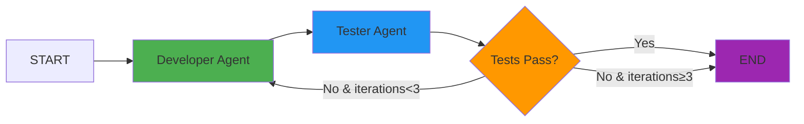

<div align="center">

# 🤖 LangGraph Self-Correcting Agent

[](https://www.python.org/downloads/)
[](https://fastapi.tiangolo.com/)
[](https://github.com/langchain-ai/langgraph)
[](LICENSE)
[](https://groq.com/)

**Production-ready AI coding assistant with self-correction loops, intelligent error handling, and automatic retries**

[Features](#-features) • [Quick Start](#-quick-start) • [Architecture](#-architecture) • [API Docs](#-api-endpoints) • [Deploy](#-deployment)

---

</div>

## 🎯 Overview

A **multi-agent system** built with LangGraph that generates, tests, and automatically fixes Python code. The agent learns from execution failures and iteratively improves code quality through intelligent feedback loops.

### What Makes This Special?

✨ **Self-Healing**: Automatically debugs and fixes failed code (up to 3 iterations)  
🔄 **Smart Routing**: Conditional workflow routing based on execution results  
💪 **Resilient**: Exponential backoff retry logic for API failures  
🧠 **Context-Aware**: Native LangGraph message history for intelligent conversations  
⚡ **Fast**: Powered by Groq's lightning-fast LLM inference  
🏭 **Production-Ready**: Comprehensive logging, error handling, and safety guards

---

## 🚀 Features

| Feature | Description |
|---------|-------------|
| **🔄 Self-Correction Loop** | If generated code fails tests, routes back to developer agent with error context |
| **🧪 Automated Testing** | Generates test cases using LLM and executes code in sandboxed environment |
| **🔁 API Retry Logic** | Tenacity-based exponential backoff for transient network failures |
| **💬 Conversation Memory** | Maintains full message history using LangGraph state reducers |
| **🎛️ Configurable Guards** | Max iteration limits prevent infinite loops |
| **📊 Execution Reports** | Detailed test results and execution logs |
| **🔒 Sandboxed Execution** | Safe code execution with isolated scope |

---

## 📦 Quick Start

### Prerequisites

- Python 3.11 or higher
- [Groq API key](https://console.groq.com) (free tier available)

### Installation

```bash
# Clone the repository
git clone https://github.com/Sathvik1533/LangGraph_deployment.git
cd LangGraph_deployment

# Install dependencies
pip install -r requirements.txt

# Configure environment
cp .env.example .env
# Edit .env and add your GROQ_API_KEY
```

### Run Locally

```bash
# Start the FastAPI server
uvicorn app:app --reload

# Server will start at http://localhost:8000
```

### Test the Agent

**Option 1: Interactive API Docs**
```
Visit http://localhost:8000/docs
```

**Option 2: cURL**
```bash
curl -X POST "http://localhost:8000/agent/invoke" \
  -H "Content-Type: application/json" \
  -d '{
    "input": {
      "task": "Write a function to calculate fibonacci numbers"
    }
  }'
```

**Option 3: Python Script**
```bash
python test_agent.py "Write a function to reverse a list"
```

---

## 🏗️ Architecture



### Workflow Components

| Component | Role | Technology |
|-----------|------|------------|
| **Developer Agent** | Generates Python code based on task description | Groq LLM (Llama 3.3 70B) |
| **Tester Agent** | Creates test cases and executes code | LangChain Tools + Python exec() |
| **Conditional Router** | Routes workflow based on execution results | LangGraph Conditional Edges |
| **State Manager** | Maintains conversation history | LangGraph State Reducers |
| **Retry Handler** | Handles API failures with backoff | Tenacity |

### How It Works

1. **User sends task** → Developer agent receives task description
2. **Code generation** → LLM generates Python code solution
3. **Test execution** → Tester agent creates test cases and executes code
4. **Result evaluation** → Checks if code executed successfully
5. **Conditional routing**:
   - ✅ **Success** → Return code and report to user
   - ❌ **Failure** → Send error feedback to developer agent (repeat from step 2)
6. **Max iterations guard** → Stops after 3 attempts to prevent infinite loops

---

## 📡 API Endpoints

### Core Endpoints

| Endpoint | Method | Description |
|----------|--------|-------------|
| `/` | `GET` | Health check |
| `/agent/invoke` | `POST` | Execute agent workflow (single request) |
| `/agent/batch` | `POST` | Batch process multiple tasks |
| `/agent/stream` | `POST` | Stream responses in real-time |
| `/docs` | `GET` | Interactive API documentation (Swagger UI) |
| `/redoc` | `GET` | Alternative API docs (ReDoc) |

### Request Format

```json
{
  "input": {
    "task": "Write a function to check if a number is prime"
  }
}
```

### Response Format

```json
{
  "output": {
    "code": "def is_prime(n):\n    if n < 2:\n        return False\n    for i in range(2, int(n**0.5) + 1):\n        if n % i == 0:\n            return False\n    return True",
    "report": "### EXECUTION OUTPUT:\nTrue\n\n### TEST SCENARIOS EVALUATED:\n1. Test with n=2 (smallest prime)\n2. Test with n=17 (prime number)\n3. Test with n=1 (edge case)\n4. Test with n=100 (composite number)\n\n✅ Code executed successfully!",
    "execution_success": true,
    "iterations": 1
  }
}
```

---

## ⚙️ Configuration

### State Persistence

The agent supports two modes of operation:

**1. Development Mode (Default)**
- Uses in-memory state storage
- Fast and simple
- State is lost on server restart
- Perfect for testing and development

**2. Production Mode (Optional - Redis)**
- Persistent state storage with Redis
- Survives server restarts
- Enables multi-instance deployments
- Supports conversation resumption

To enable Redis persistence:
```bash
# Install Redis dependencies (optional)
pip install langgraph-checkpoint-redis redis

# Add to .env
REDIS_URL=redis://localhost:6379
```

**Note:** Redis is NOT required for deployment. The agent works perfectly fine with in-memory storage for most use cases.

### Environment Variables

Create a `.env` file in the root directory:

```bash
# Required
GROQ_API_KEY=gsk_your_api_key_here

# Optional - Model Configuration
GROQ_MODEL=llama-3.3-70b-versatile

# Optional - Redis for State Persistence (Production)
# If not set, uses in-memory storage (development mode)
# REDIS_URL=redis://localhost:6379
```

### Available Models

| Model | Context Window | Best For |
|-------|---------------|----------|
| `llama-3.3-70b-versatile` | 8K tokens | General coding tasks (default) |
| `llama-3.1-70b-versatile` | 8K tokens | Alternative high-quality model |
| `mixtral-8x7b-32768` | 32K tokens | Long context tasks |

### Workflow Configuration

Adjust settings in `agent.py`:

```python
# Max self-correction attempts
MAX_ITERATIONS = 3

# API retry settings
llm_retry = retry(
    stop=stop_after_attempt(3),              # Max API retries
    wait=wait_exponential(min=1, max=10),    # Backoff: 1s→2s→4s→8s (max 10s)
    retry=retry_if_exception_type(Exception)
)

# LLM temperature (0.1 for consistent code generation)
temperature = 0.1
```

---

## 🌐 Deployment

### Deploy to Render

1. **Push to GitHub** (already done ✅)

2. **Create Web Service on Render**:
   - Go to [render.com](https://render.com)
   - Click "New +" → "Web Service"
   - Connect this repository

3. **Configure Build Settings**:
   ```
   Build Command: pip install -r requirements.txt
   Start Command: uvicorn app:app --host 0.0.0.0 --port $PORT
   ```

4. **Set Environment Variable**:
   ```
   GROQ_API_KEY = your_api_key_here
   ```

5. **Deploy** 🚀

### Deploy to Other Platforms

<details>
<summary><b>Heroku</b></summary>

```bash
# Create Heroku app
heroku create your-app-name

# Set environment variable
heroku config:set GROQ_API_KEY=your_api_key_here

# Deploy
git push heroku main
```
</details>

<details>
<summary><b>Railway</b></summary>

1. Connect your GitHub repository
2. Add environment variable: `GROQ_API_KEY`
3. Railway auto-detects Python and deploys
</details>

<details>
<summary><b>Docker</b></summary>

```dockerfile
FROM python:3.11-slim
WORKDIR /app
COPY requirements.txt .
RUN pip install --no-cache-dir -r requirements.txt
COPY . .
EXPOSE 8000
CMD ["uvicorn", "app:app", "--host", "0.0.0.0", "--port", "8000"]
```

```bash
docker build -t langgraph-agent .
docker run -p 8000:8000 -e GROQ_API_KEY=your_key langgraph-agent
```
</details>

---

## 📂 Project Structure

```
LangGraph_deployment/
├── agent.py              # 🧠 LangGraph workflow & agent logic
├── app.py                # 🌐 FastAPI application & API routes
├── index.html            # 🎨 Interactive frontend dashboard
├── test_agent.py         # 🧪 Testing script
├── verify_setup.py       # ✅ Setup verification script
├── requirements.txt      # 📦 Python dependencies
├── runtime.txt           # 🐍 Python version specification
├── .env.example          # 📝 Environment variables template
├── .env                  # 🔒 Your API keys (gitignored)
├── docs/                 # 📚 Comprehensive documentation
│   ├── ARCHITECTURE.md
│   ├── FRONTEND_EXPLAINED.md
│   ├── ERROR_HANDLING_GUIDE.md
│   ├── PRODUCTION_PATTERNS.md
│   └── ...
├── extras/               # 🎁 Optional components (Gradio UI)
└── README.md             # 📖 This file
```

---

## 🧪 Testing

### Run Test Script

```bash
# Test with default task
python test_agent.py

# Test with custom task
python test_agent.py "Write a function to merge two sorted lists"
```

### Manual Testing

```python
from agent import agent
from langchain_core.messages import HumanMessage

# Invoke the agent
result = agent.invoke({
    "messages": [HumanMessage(content="Write a function to calculate factorial")],
    "code": None,
    "report": None,
    "execution_success": False,
    "iterations": 0
})

print(result["code"])
print(result["report"])
```

---

## 🔬 Technical Deep Dive

### State Reducers

LangGraph's state reducers prevent message history from being overwritten:

```python
from operator import add
from typing_extensions import Annotated

class CrewState(TypedDict):
    messages: Annotated[List[BaseMessage], add]  # Messages are appended, not replaced
    code: Optional[str]
    report: Optional[str]
    execution_success: bool
    iterations: int
```

### Self-Correction Flow

```python
def should_continue(state: CrewState) -> Literal["developer", "end"]:
    """Route back to developer if tests fail, otherwise end"""
    MAX_ITERATIONS = 3
    
    if state.get("iterations", 0) >= MAX_ITERATIONS:
        return "end"  # Prevent infinite loops
    
    if state.get("execution_success", False):
        return "end"  # Success - we're done!
    
    return "developer"  # Failure - retry with error feedback
```

### API Resilience

Tenacity retries transient API failures automatically:

```python
@retry(
    stop=stop_after_attempt(3),
    wait=wait_exponential(multiplier=1, min=1, max=10),
    retry=retry_if_exception_type(Exception)
)
def call_llm_with_retry(prompt):
    return llm.invoke(prompt)
```

**What gets retried:**
- Connection errors
- Timeout errors
- Rate limits (429 errors)
- Temporary service unavailability

**What doesn't get retried:**
- Authentication errors (wrong API key)
- Invalid model errors
- Malformed requests

---

## 📚 Documentation

Comprehensive documentation is available in the [`docs/`](./docs) folder:

- **[Architecture Guide](./docs/ARCHITECTURE.md)** - System design and workflow
- **[Frontend Explained](./docs/FRONTEND_EXPLAINED.md)** - Complete UI architecture
- **[Error Handling](./docs/ERROR_HANDLING_GUIDE.md)** - Multi-layer error handling strategy
- **[Production Patterns](./docs/PRODUCTION_PATTERNS.md)** - Circuit breaker, rate limiting, jitter
- **[Configuration](./docs/CONFIGURATION_EXPLAINED.md)** - Environment variables explained
- **[FAQ](./docs/QUESTIONS_ANSWERED.md)** - Common questions answered

---

## 🤝 Contributing

Contributions are welcome! Please feel free to submit a Pull Request.

1. Fork the repository
2. Create your feature branch (`git checkout -b feature/AmazingFeature`)
3. Commit your changes (`git commit -m 'Add some AmazingFeature'`)
4. Push to the branch (`git push origin feature/AmazingFeature`)
5. Open a Pull Request

---

## 📄 License

This project is licensed under the MIT License - see the [LICENSE](LICENSE) file for details.

---

## 🙏 Acknowledgments

Built with amazing open-source technologies:

- **[LangGraph](https://github.com/langchain-ai/langgraph)** - Agent orchestration framework
- **[LangChain](https://github.com/langchain-ai/langchain)** - LLM application framework
- **[FastAPI](https://fastapi.tiangolo.com/)** - Modern Python web framework
- **[Groq](https://groq.com/)** - Lightning-fast LLM inference
- **[Tenacity](https://github.com/jd/tenacity)** - Retry logic library

---

## 📬 Contact

**Sathvik** - [@Sathvik1533](https://github.com/Sathvik1533)

**Project Link**: [https://github.com/Sathvik1533/LangGraph_deployment](https://github.com/Sathvik1533/LangGraph_deployment)

---

<div align="center">

**⭐ Star this repo if you find it helpful!**

Made with ❤️ using LangGraph and FastAPI

</div>