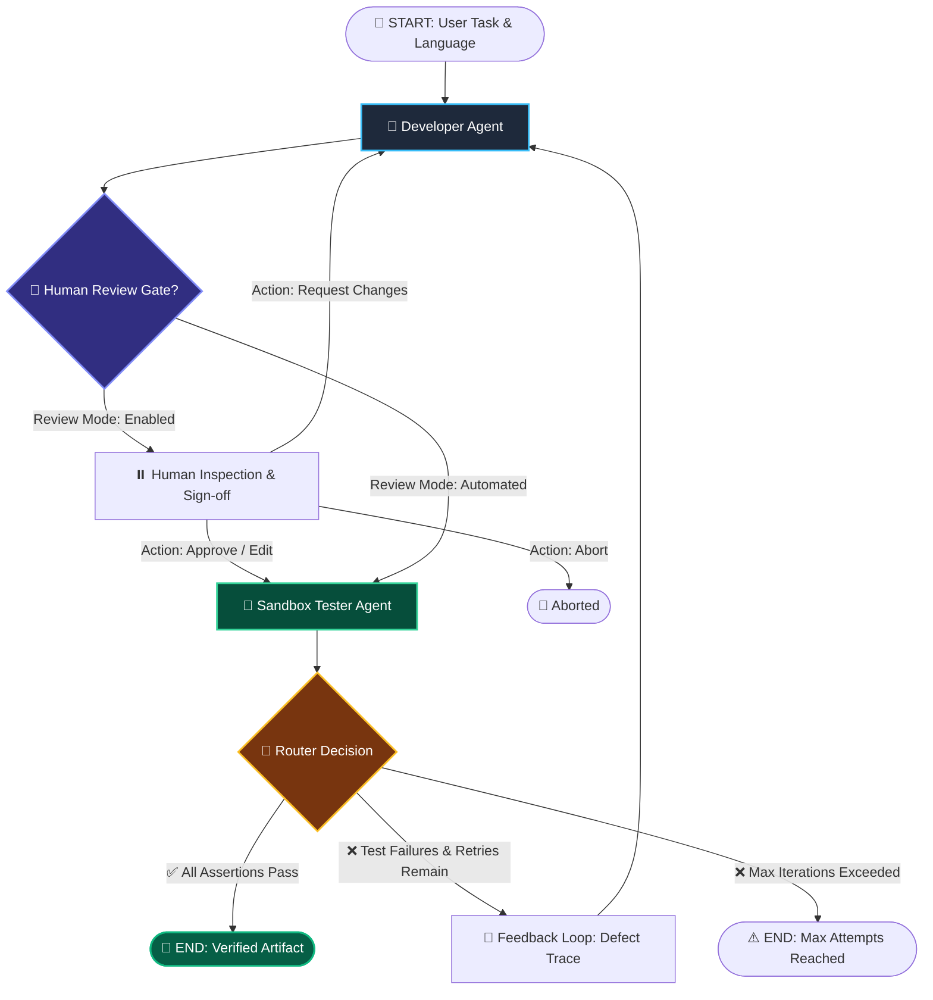

# AI Workflow Studio — Production Multi-Agent Orchestration Platform

<div align="center">

[](https://www.python.org/)
[](https://fastapi.tiangolo.com/)
[](https://github.com/langchain-ai/langgraph)
[](https://opensource.org/licenses/MIT)
[](https://render.com)
[](https://owasp.org/www-project-top-10-for-large-language-model-applications/)

**An enterprise-grade, multi-agent AI system featuring real self-healing test loops, interactive Human-in-the-Loop checkpoints, OWASP LLM Top 10 guardrails, and real-time event streaming.**

[Live Demo](https://langgraph-deployment-qhy0.onrender.com/) • [API Reference](#-api-reference) • [Architecture](#-architecture) • [Quickstart](#-quickstart) • [Security](#-guardrails--security)

</div>

---

## 🌟 Executive Overview

**AI Workflow Studio** is an autonomous code generation, validation, and self-correction platform powered by **LangGraph** and **FastAPI**. Unlike traditional single-pass generative models that produce hallucinated or broken code, AI Workflow Studio orchestrates specialized agent nodes across an isolated execution sandbox to iteratively synthesize, execute, debug, and verify production-ready code.

### 🔑 Key Pillars

- **🔄 Real Self-Correction Loop**: Cyclic state graph evaluates real sandbox runtime test assertions, feeding precise error traces back into the Developer Agent for automated self-healing.
- **👤 Human-in-the-Loop (HITL) Gate**: Configurable pause checkpoint enabling human developers to inspect, modify in-place, request AI revisions, or abort before sandbox execution.
- **🛡️ OWASP LLM Defense Shield**: Comprehensive input/output guardrails trapping prompt injections, system prompt extraction, dangerous OS commands, and PII leaks.
- **⚡ Real-Time SSE Event Stream**: Server-Sent Events (SSE) telemetry pipeline broadcasting live agent lifecycle states, node activations, and state changes to the UI.
- **🌐 Polyglot Execution Sandbox**: First-class generation and sandbox verification across **Python 3.11**, **Java 17**, and **C++ 20**.

---

## 🏗️ Architecture

The engine runs as a compiled **LangGraph StateGraph** with conditional routing and dynamic checkpointing:



### Agent Node Breakdown

| Agent / Component | Primary Responsibility | Isolation & Tooling |
| :--- | :--- | :--- |
| **Input Guardrails** | Pre-execution safety filter checking for prompt injection & topic boundaries | OWASP Pattern Matcher & Regex AST |
| **Developer Agent** | Synthesizes clean, idiomatic source code without markdown conversational filler | Groq LLaMA-3.3-70B / Fallback Engine |
| **Human Review Gate** | Intercepts candidate code for manual review, code editing, or guided revisions | LangGraph State Checkpoint |
| **Sandbox Tester** | Compiles and runs test assertions against generated candidate code | Subprocess Sandbox with Strict Timeout |
| **Router Node** | Inspects test verdict, manages iteration counters, and dispatches retry loops | Conditional Edge Resolver |
| **Output Guardrails** | Scans generated code for dangerous system commands and PII leaks | Safety Lexer & PII Regex Scanners |

---

## 🚀 Quickstart

### Prerequisites
- Python 3.10+ (Recommended: 3.11)
- Java 17 JRE (optional, for Java verification)
- G++ / GCC 11+ (optional, for C++ verification)

### 1. Clone & Install
```bash
git clone https://github.com/Sathvik1533/LangGraph_deployment.git
cd LangGraph_deployment

# Create virtual environment
python3 -m venv venv
source venv/bin/activate

# Install production dependencies
pip install -r requirements.txt
```

### 2. Configure Environment
```bash
cp .env.example .env
# Edit .env and supply your Groq API key:
# GROQ_API_KEY=gsk_your_api_key_here
```

### 3. Launch Development Server
```bash
python -m uvicorn app:app --host 127.0.0.1 --port 8000 --reload
```
Open your browser at `http://127.0.0.1:8000` to access the studio.

---

## 🐳 Docker Deployment

### Run via Docker Compose
```bash
docker-compose up --build -d
```
The application will be accessible at `http://localhost:8000` with active container healthchecks.

---

## 🧪 Testing & Verification

The repository includes a comprehensive test suite covering agent node execution, guardrails, HITL actions, and API endpoints:

```bash
# Install test requirements
pip install -r requirements-dev.txt

# Run full test suite
pytest tests/ -v

# Run with coverage report
pytest --cov=app --cov=agent --cov=guardrails tests/
```

---

## 📡 API Reference

### Core Endpoints

#### `POST /generate`
Generate code synchronously through the full agent pipeline.
```json
// Request
{
  "task": "Write a Python function to reverse a string and create tests for it.",
  "language": "python",
  "max_iterations": 3,
  "hitl_mode": false
}

// Response (200 OK)
{
  "success": true,
  "code": "def reverse_string(text: str) -> str:\n    return text[::-1]...",
  "filename": "StringReverser.py",
  "report": "All 3 test scenarios evaluated successfully.",
  "execution_success": true,
  "iterations": 1,
  "thread_id": "thread_abc123"
}
```

#### `GET /stream`
Initiate a Server-Sent Events (SSE) stream for real-time live execution telemetry.
```bash
curl -N "http://localhost:8000/stream?task=Implement+binary+search&language=python&mode=live"
```

#### `POST /hitl/action`
Submit a decision at the Human Review Gate.
```json
// Request
{
  "thread_id": "thread_abc123",
  "action": "approve", // "approve" | "edit" | "reject" | "abort"
  "edited_code": null,
  "feedback": "Ensure edge case for empty strings is handled",
  "language": "python"
}
```

#### `GET /guardrails`
Inspect real-time statistics and defense posture of the security shield.

---

## 🛡️ Guardrails & Security

AI Workflow Studio implements **OWASP LLM Top 10** controls:

```
[User Request] 
      │
      ▼
┌──────────────────────────────────────────────┐
│ INPUT GUARDRAILS                             │
│ • Prompt Injection Scanner                   │
│ • System Prompt Override Filter              │
│ • Topic Boundary Verifier                    │
└──────────────────────┬───────────────────────┘
                       │ Validated
                       ▼
┌──────────────────────────────────────────────┐
│ LANGGRAPH MULTI-AGENT WORKFLOW               │
│ • Developer ➔ Human Review ➔ Sandbox Tester  │
└──────────────────────┬───────────────────────┘
                       │ Output Artifact
                       ▼
┌──────────────────────────────────────────────┐
│ OUTPUT GUARDRAILS                            │
│ • Malicious OS Command Filter (rm, dd, etc.) │
│ • PII & Secret Redactor                      │
│ • Relevance & Format Verifier                │
└──────────────────────┬───────────────────────┘
                       │ Safe
                       ▼
[Client Response]
```

---

## 📂 Project Directory Structure

```
LangGraph_deployment/
├── .github/                     # CI/CD Workflows and GitHub templates
│   ├── workflows/               # Automated testing & deployment actions
│   └── ISSUE_TEMPLATE/          # Bug & feature templates
├── data/                        # Persistent audit history storage
├── docs/                        # Deep technical guides & specifications
├── pages/                       # Multi-page responsive frontend views
│   ├── dashboard.html           # Architecture & telemetry overview
│   ├── generate.html            # Interactive agent workspace
│   ├── workflow.html            # Live SVG graph visualizer
│   └── history.html             # Audit trail & playback engine
├── static/                      # Production stylesheets & client scripts
│   ├── css/shared.css           # Glassmorphic design tokens
│   └── js/                      # Modular client state & SSE controllers
├── tests/                       # Pytest test suite
├── agent.py                     # LangGraph StateGraph & Multi-Agent engine
├── app.py                       # FastAPI application & SSE streaming engine
├── guardrails.py                # OWASP LLM security shield
├── Dockerfile                   # Multi-stage production container
├── docker-compose.yml           # Container orchestration
├── pyproject.toml               # Packaging & tool configurations
└── requirements.txt             # Pinned production dependencies
```

---

## 📄 License

This project is licensed under the **MIT License** — see the [LICENSE](LICENSE) file for details.